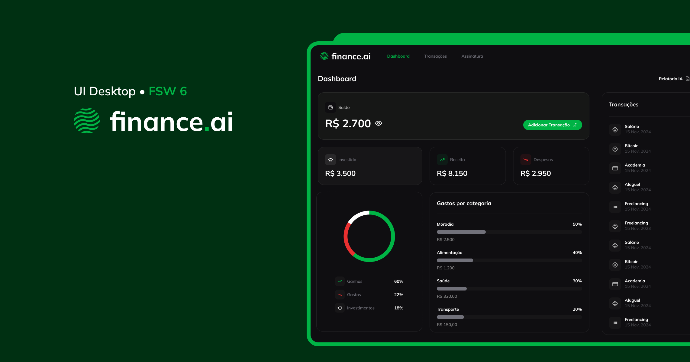

# Finance AI

A Finance AI é uma plataforma de gestão financeira desenvolvida para ajudar usuários a monitorarem suas movimentações financeiras, organizarem seu orçamento e receberem insights inteligentes com apoio de IA.

O projeto foi desenvolvido como parte do curso prático da FullStack Club, utilizando uma stack moderna com Next.js, Prisma, PostgreSQL e TailwindCSS.

## ✨ Funcionalidades

- Cadastro e autenticação de usuários
- Dashboard financeiro
- Adição, edição e remoção de transações
- Controle de receitas, despesas e investimentos
- Relatórios por categoria
- Filtros por data e tipo de transação
- Interface moderna e responsiva
- Insights financeiros gerados com IA
- Persistência de dados em banco PostgreSQL

## 🖼️ Preview

A plataforma possui:

- Dashboard com saldo atual, receitas, despesas e investimentos
- Lista de transações recentes
- Modal para adicionar novas transações
- Tela para edição de movimentações
- Relatórios e gráficos de gastos por categoria

## 🚀 Tecnologias Utilizadas

### Front-end

- Next.js 14
- React 18
- TypeScript
- TailwindCSS
- tailwindcss-animate
- Lucide React
- Radix UI Slot
- clsx
- class-variance-authority
- tailwind-merge

### Back-end e Banco de Dados

- Prisma ORM
- PostgreSQL
- NeonDB
- Clerk Authentication

### Ferramentas de Desenvolvimento

- ESLint
- Prettier
- prettier-plugin-tailwindcss
- Husky
- lint-staged
- git-commit-msg-linter
